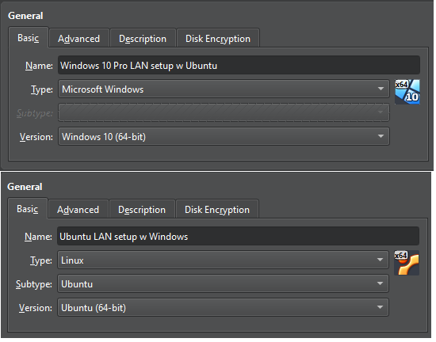
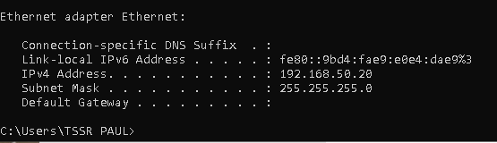
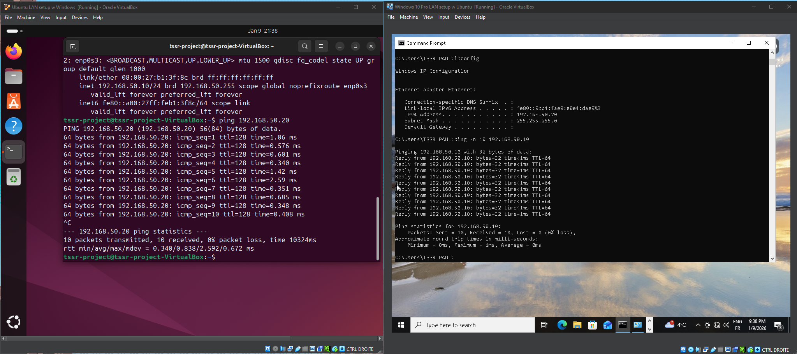

# Mini LAN Windows / Ubuntu (VirtualBox)

## Objective
The goal of this project is to set up a Linux virtual machine (Ubuntu)
and a Windows virtual machine (Windows 10 Pro) and to verify network
connectivity between them using the ping command.

## Environment
Hypervisor: VirtualBox
Virtual machines:
  - Windows 10 Pro
  - Ubuntu 24.04
Network type: Internal Network

## Network Configuration
- Ubuntu: 192.168.50.10/24
- Windows: 192.168.50.20/24
- Subnet mask: 255.255.255.0
- Gateway: none (local LAN only)

## Configuration Summary
### Ubuntu
- Static IP address configured using netplan
- Network managed by NetworkManager

### Windows
- Static IPv4 address configured manually
- Windows Defender Firewall adjusted to allow ICMPv4 (ping) inbound traffic

## Validation
Connectivity between the two machines was verified using the ping command
from Windows to Ubuntu and from Ubuntu to Windows.

## Screenshots

